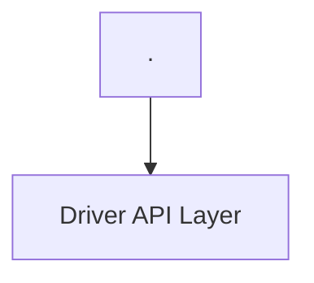
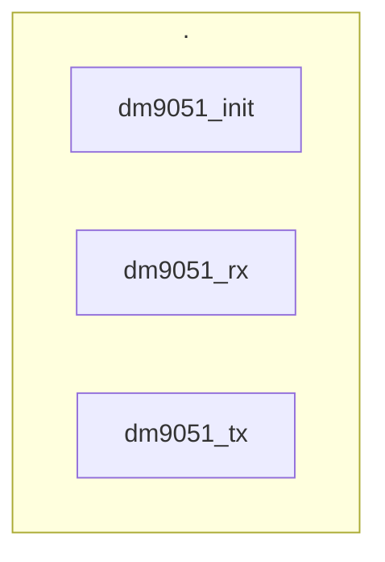
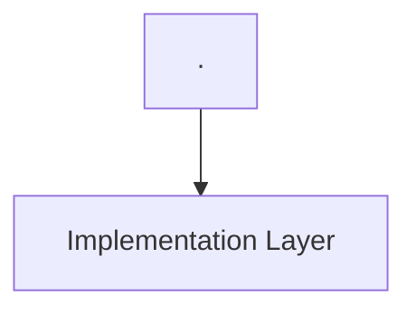
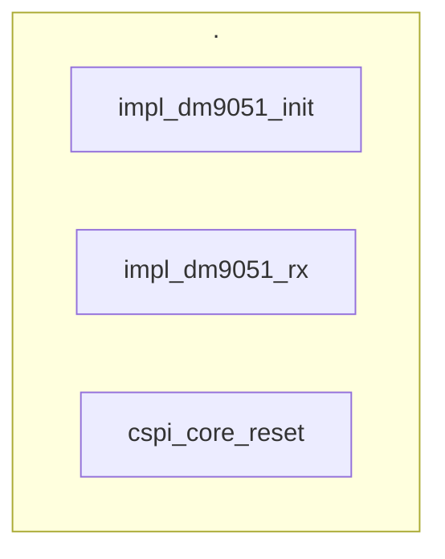
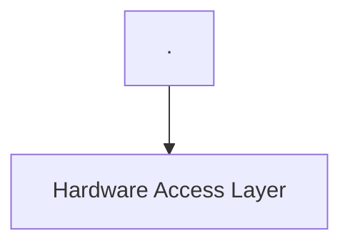
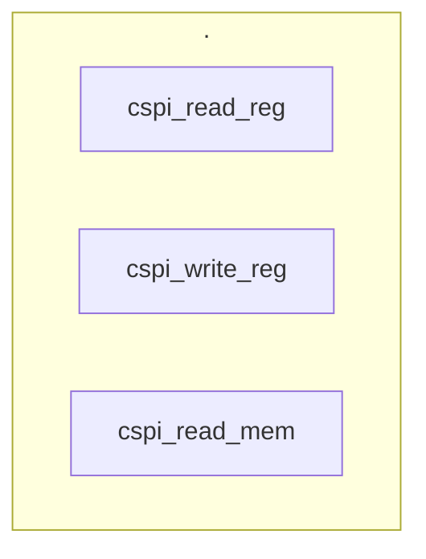
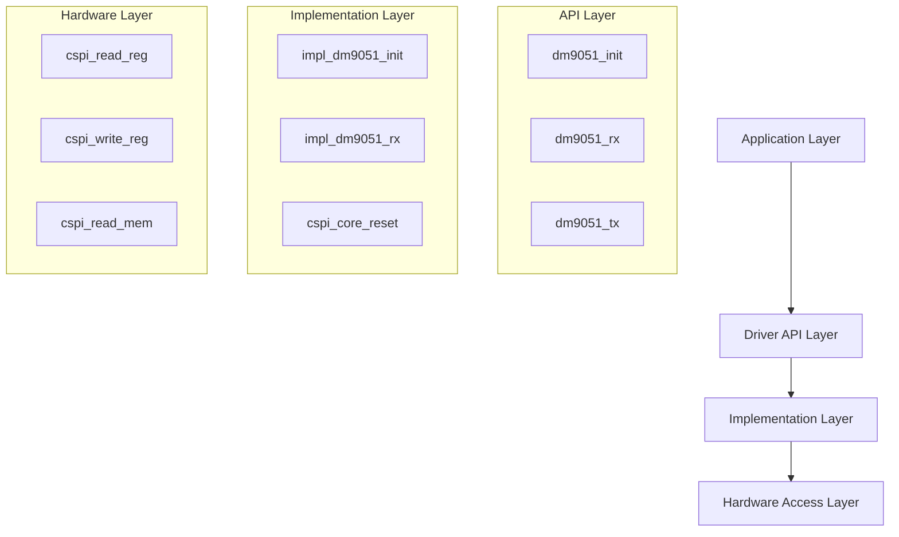

# 1 Using Mermaid
## Mermaid chart

```c
graph TD
    A[Application Layer] --> B[Driver API Layer]
    B --> C[Implementation Layer]
    C --> D[Hardware Access Layer]
```
## Mermaid chart extend








# 2 Cursor elaborate
```graph TD
    A[Application Layer] --> B[Driver API Layer]
    B --> C[Implementation Layer]
    C --> D[Hardware Access Layer]
    
    subgraph "API Layer"
    B1[dm9051_init]
    B2[dm9051_rx]
    B3[dm9051_tx]
    end
    
    subgraph "Implementation Layer"
    C1[impl_dm9051_init]
    C2[impl_dm9051_rx]
    C3[cspi_core_reset]
    end
    
    subgraph "Hardware Layer"
    D1[cspi_read_reg]
    D2[cspi_write_reg]
    D3[cspi_read_mem]
    end
```

# Using Mermaid

